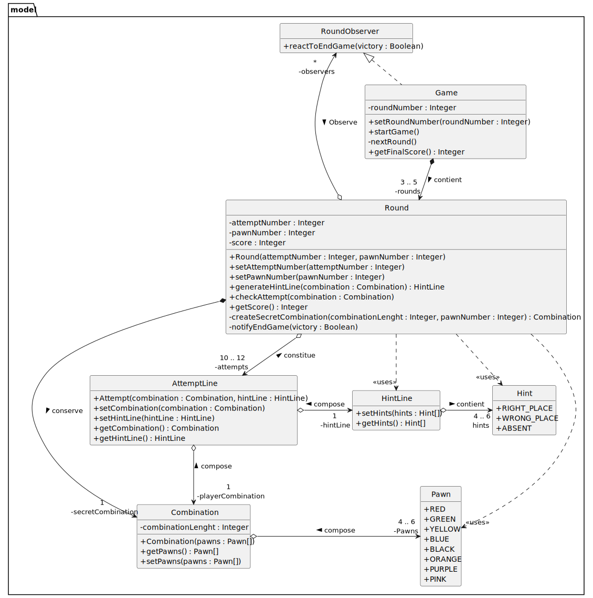

# Rapport A31

## Rapport 1 - 3 décembre

Ce diagramme représente l'avancement actuel du projet

On y retrouve Game, qui représente une partie, mais aussi Round qui correspond à une manche, 
une partie possède 3 à 5 manches et a un attribut statique décrivant le nombre de manches.

Une manche est composé de ligne de tentatives, cette classe sert à faire le lien entre une combinaison et ses indices
Elle assure également la synchronisation et s'appuie sur les classes Combination et HintLine elles-mêmes se servant
d'énumération.

La combinaison secrète est un attribue Combination d'une manche, c'est à la manche de générer sa combinaison.
